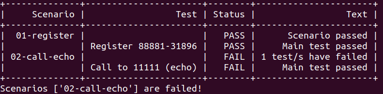
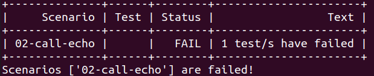
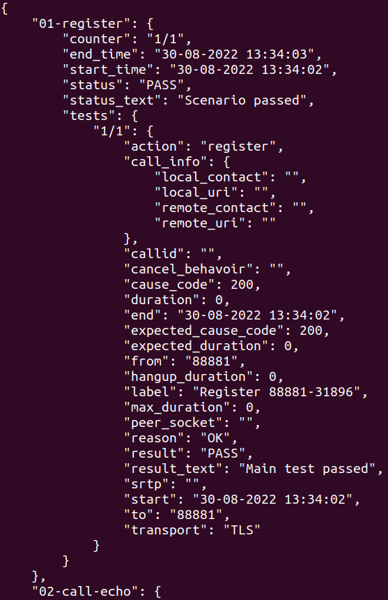
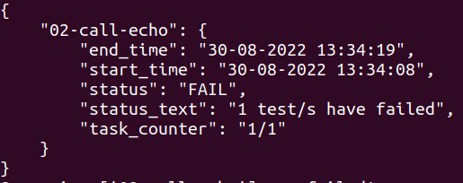

# VOLTS
**Voip Open Linear Tester Suite**
This module is constanly testing CERNPhone. It runs all tests in the `/root/scenarios/` periodically. After each run, it sends the status of CERNPhone to MONIT. To run the tests it uses the same architecture than in [functional testing](https://gitlab.cern.ch/cernphone/functional-testing), based on [VoIP Patrol](https://github.com/igorolhovskiy/voip_patrol) and docker.

## Run
The tests run logic is in `run.sh` and `run_and_log.sh` files.
Those files are executed periodically by a CRON job.
To ensure mutual exclusion between tests runs, VOLTS uses a lock. Specifically, it tries to create the `/tmp/volts.lock/` directory. If it already exists shows an error and doesn't run the tests.
Otherwise, it starts pulling the docker images from the repository and runs the tests.
All the tests results are stored in log files in the `/var/log/volts/` directory, as well as, a `jsonl` file with the raw data generated by the `database` and the `vp` containers.
The log files are keept save during a configurable amount of days.

Apart from the CRON job, there is the posibility of running all the tests, executing:
```
/root/run.sh
```
This script will print the results on the screen. If it is prefered to generate the correspondant log files, execute:
```
/root/run_and_log.sh
```


## Configuration
In the following table are listed all the variable that could be configured. They are stored in the `code/data/volts.yaml` hiera file.
| Hiera variable        |                                                                                       |
| --------------------- | ------------------------------------------------------------------------------------- |
| report_type           | Supported options: `table`, `table_full`, `json`, and `json_full`                     |
| monit_address         | Target address to send data to monit                                                  |
| threshold_degraded    | Indicates the threshold of failed tests needed to show the application as degraded    |
| threshold_unavailable | Indicates the threshold of failed tests needed to show the application as unavailable |
| cron_min              | Regulates the frequency of testing ([`cron`](https://crontab.guru/) notation)         |
| logs_backup_days      | How long the logs would be stored (in days)                                           |
| is_send_to_monit      | Specifies if the data should be sent to MONIT                                         |
| docker_repository     | Docker repository where the images are pulled from                                    |
| email                 | Email address provided to MONIT team                                                  |
| docker_username       | Docker username for pulling the images from the registry                              |
| vp_result_file_name   | Results file name of `vp`                                                             |
| db_result_file_name   | Results file name of `database`                                                       |

### Credentials
The credentials needed to pull the images i.e. to execute `docker login` are managed by `teigi`.
To add a new token, run on a vm:
```
tbag set --hg hg_tone/mgmt/volts funct-test-registry-read
```

## Report
In the next chart are all the currently supported ways to print the results of the tests. To select any of those see `report_type` in [Configuration](#configuration)
| REPORT_TYPE | Output |
| ----------- | ------ |
| table_full  ||
| table       ||
| json_full   ||
| json        ||

### MONIT


